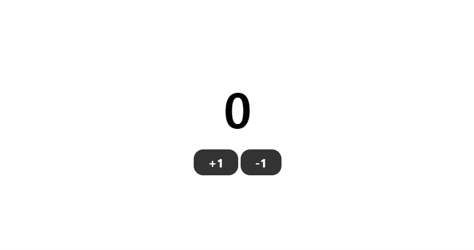

[← 뒤로](./README.md)

# 미니 리덕스 만들기

- 세미나 일자: 2021-06-22(화)
- 등장인물
    - 우아한 형제들 기술이사 김민태님👓
    - 아흔 아홉명의 교육생들🖐
        - 나🥎

## 우리의 대화
- 이날 나는 소리없이 강의를 들어야 했다(개인사정상)
    - 음소거로 봤으니 수업시간에 구현한 코드 이해는 내 몫이다
- 강의를 놓치기는 싫어서 핸드폰으로 줌을 슬쩍 켜놓고 노트북에는 코드샌드박스를 열어놓은 채 은밀히 코드를 따라 쳤다.
    - 🔗 [코드샌드박스 보러가기](https://codesandbox.io/embed/loving-mendel-j3fzm?fontsize=14&hidenavigation=1&theme=light)

### 미니 리덕스 만들기

```js
// index.js
function createStore(reducer, middleware = []) {
  let state = {};

  let dispatch = (action) => {
    reducer(action);
  };

  let backupDispatch = dispatch;

  middleware.reverse().forEach((m) => {
    backupDispatch = m(store)(backupDispatch);
  });

  const store = {
    getState: () => {},
    dispatch: backupDispatch
  };

  return store;
}

function reducer(action) {
  console.log(action);
}

const fetchUserInfo = (store) => (next) => (action) => {
  if (action.type === "fetch user info") {
    setTimeout(() => {
      next({
        type: "response user info"
      });
    }, 3000);
  } else {
    next(action);
  }
  console.log("logger B => ", action.type);
};

const store = createStore(reducer, [fetchUserInfo]);

store.dispatch({ type: "fetch posts" });
store.dispatch({ type: "fetch user info" });

/*
{type: "fetch posts"}
logger B =>  fetch posts 
logger B =>  fetch user info 
{type: "response user info"}
*/
```

---

### 바닐라 JS로 미니 리덕스 구현하고 카운터 만들기
- 위의 예제만으로는 완전한 이해가 어려워서 '바닐라 자바스크립트로 구현한 미니 리듀서로 간단한 카운터'를 구현하는 튜토리얼을 찾아서 따라해봤다.
    - 🔗 [How to Implement Redux in 24 Lines of JavaScript](https://www.freecodecamp.org/news/redux-in-24-lines-of-code/)
- 내가 직접 따라해본 코드는 아래 링크에서 확인할 수 있다. 
    - 🔗 [코드샌드박스 보러가기](https://codesandbox.io/embed/distracted-worker-jhovj?fontsize=14&hidenavigation=1&theme=dark)
    
    - 튜토리얼과 다르게 파일을 좀 더 분리했다. 
        - 실제 `Redux`를 구현한 파일은 `redux.js`
        - 액션과 리듀서는 `modules/counter.js`
        - 그밖에 카운터 요소의 노드를 취득하여 동적으로 조작하는 코드는 `index.js` 파일에 있다.     


```js
// redux.js
const createStore = (reducer) => {
  let listeners = [];
  let currentState = reducer(undefined, {});

  return {
    // getState함수는 현재 상태를 반환
    getState: () => currentState,
    /* dispatch는 액션을 발생시키는 함수
    dispatch(action)과 같은 형태로 액션 객체를 파라미터로 넣어서 호출 */
    dispatch: (action) => {
      // 리듀서 함수를 실행하여 새로운 상태 생성
      currentState = reducer(currentState, action);
      listeners.forEach((listener) => {
        listener();
      });
    },
    /* subscirbe 함수에 리스너 함수를 파라미터로 넣어서 호출하면 
    dispatch 함수가 호출되어 상태가 업데이트될 때마다 
    리스너 함수 호출 */
    subscribe: (newListener) => {
      listeners.push(newListener);
      /* unsubscribe는 파라미터로 받은 리스너 함수가
      dispatch 함수가 호출되어 상태가 업데이트될 때마다
      호출되는 것을 비활성화하는 함수 */
      const unsubscribe = () => {
        listeners = listeners.filter((el) => el !== newListener);
      };

      return unsubscribe;
    }
  };
};

export { createStore };
```

```js
// modules/counter.js

import { createStore } from "../redux.js";

const initialState = { count: 0 };

/* 액션(Action)은 상태 변화가 필요할 때 발생
액션 객체는 반드시 type 필드를 가지고 있어야 함 */
const actions = {
  increment: { type: "INCREMENT" },
  decrement: { type: "DECREMENT" }
};

/* 리듀서(Reducer)는 변화를 일으키는 함수
리듀서는 첫번째 파라미터로 현재 상태, 두번째 파라미터로 액션 객체를 받음
두 값을 참고하여 새로운 상태를 만들어서 반환 */
const countReducer = (state = initialState, action) => {
  switch (action.type) {
    case actions.increment.type:
      return {
        count: state.count + 1
      };
    case actions.decrement.type:
      return {
        count: state.count - 1
      };
    default:
      return state;
  }
};

// 스토어 안에는 현재 상태와 리듀서가 들어있음
const store = createStore(countReducer);

export { store, actions, initialState };
```

```js
// index.js
import { store, actions, initialState } from "./modules/counter";

// DOM 선택자
const incrementButton = document.querySelector(".increment");
const decrementButton = document.querySelector(".decrement");

// 이벤트 핸들러 등록
incrementButton.addEventListener("click", () => {
  store.dispatch(actions.increment);
});

decrementButton.addEventListener("click", () => {
  store.dispatch(actions.decrement);
});

const counterDisplay = document.querySelector("h1");
counterDisplay.innerHTML = parseInt(initialState.count);

store.subscribe(() => {
  const state = store.getState();

  counterDisplay.innerHTML = parseInt(state.count);
});
```
