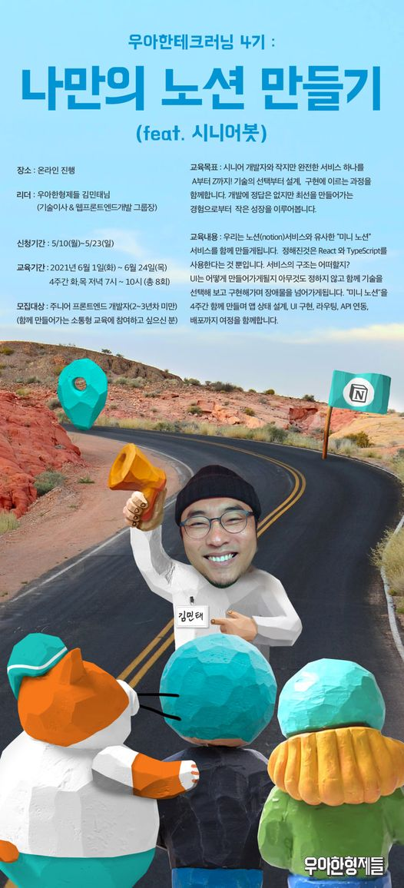

# 우아한테크러닝 4기 "나만의 노션 만들기(feat.시니어봇)"
> 우아한 테크러닝 4기에서 얻은 지식과 경험을 기록합니다

### 기간 
2021년의 6월 한달🌊

### 기록
- 6월 1일 (1차시) [우리는 한달짜리 회사를 창업했고 시니어는 한 명, 주니어는 아흔 아홉 명이에요](./0601.md)

- 6월 3일 (2차시) [그 기술을 왜 선택했어요?](./0603.md)

- 6월 8일 (3차시) [React + TypeScript로 로그인 구현하기](./0608.md)

- 6월 10일 (4차시) [안다는 것은 무엇일까 + 스타트업의 꽃 피봇](./0610.md)

- 6월 15일 (5차시) [그 컴포넌트, 정말 재활용할 수 있나요?](./0615.md)

- 6월 17일 (6차시) [상태와 변화에 대하여](./0617.md)

- 6월 22일 (7차시) [미니 리액트 만들기](./0622.md)
- 6월 29일 (8차시) [미니 리덕스 만들기](./0629.md)
